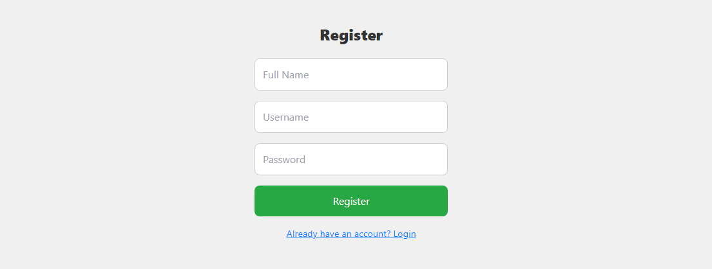

# MERN Chat App

This is a simple chat application built using the MERN stack (MongoDB, Express.js, React.js, Node.js). It allows users to chat in real-time.

# Demo

## Technologies Used

- MongoDB: A NoSQL database for storing user information and chat messages.
- Express.js: A web application framework for building the server-side of the application.
- React.js: A JavaScript library for building user interfaces.
- Node.js: A JavaScript runtime environment for running server-side code.
- Socket.io: A library for enabling real-time, bidirectional communication between the server and clients.

## Getting Started

To get started with the MERN Chat app, follow these steps:

1. Clone the repository: `git clone https://github.com/your-username/mern-chat-app.git`
2. Install the dependencies: `cd mern-chat-app && npm install`
3. Set up the environment variables: Create a `.env` file in the root directory and add the following variables:
   - `MONGODB_URI`: MongoDB connection string
   - `JWT_SECRET`: Secret key for JWT authentication
4. Start the development server: `npm run dev`
5. Open your browser and navigate to `http://localhost:3000`

## Contributing

Contributions are welcome! If you find any issues or have suggestions for improvements, please open an issue or submit a pull request.
